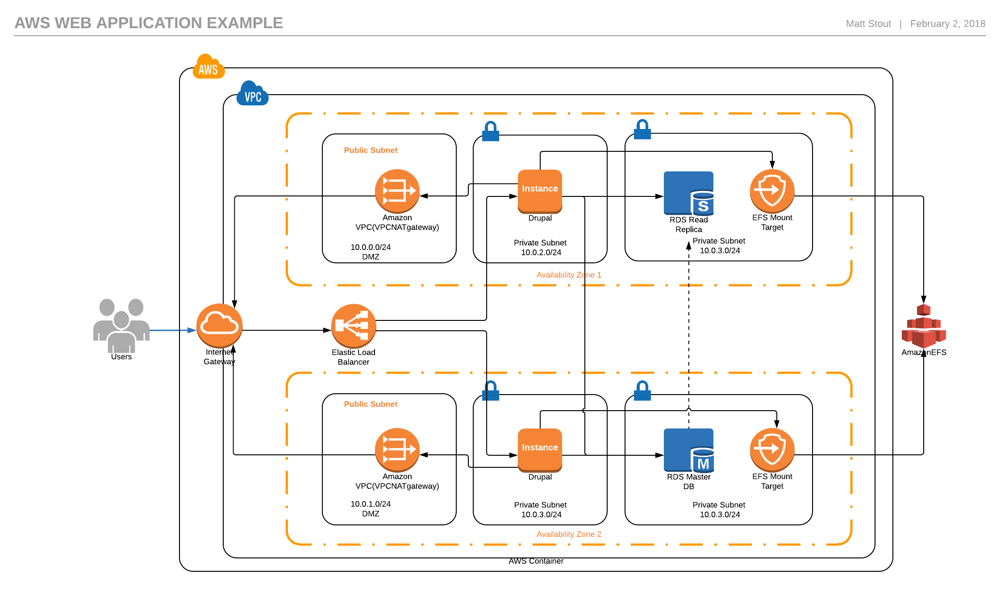

# aws-examples
Example AWS templates and artifacts 

## Overview

These templates create a simple example with some advanced features. It includes scaling examples and multiple AZ for high availability.  

This is a modified verstion of [Amazon AWS Reference Templates ](https://github.com/awslabs/aws-refarch-drupal)
