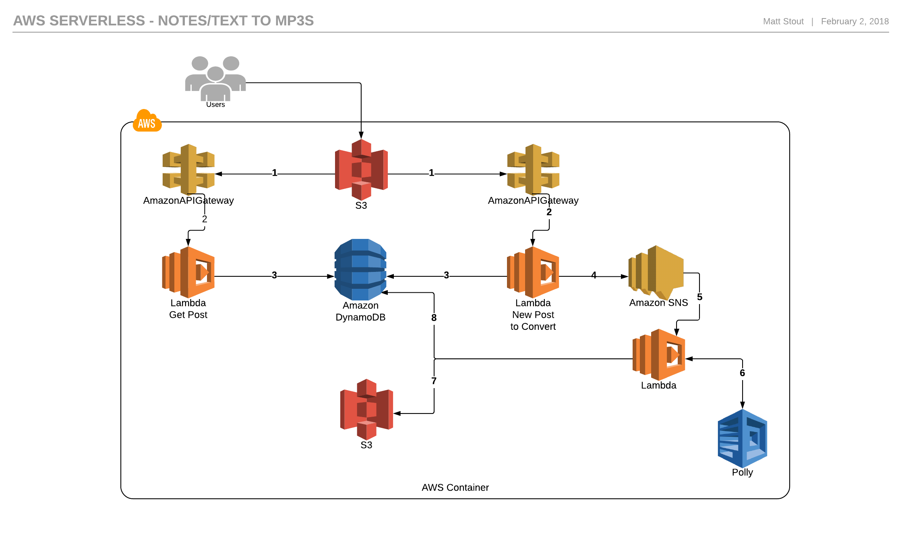

# aws-examples::Text To Audio
Here are code bits for creating lambda functions, and various policies, apis, etc to build a serverless website that will convert text to speech. Greate for turning notes into MP3s for listening to before exams. Docs and some CF Templates to automate this in the works

## Overview

 

